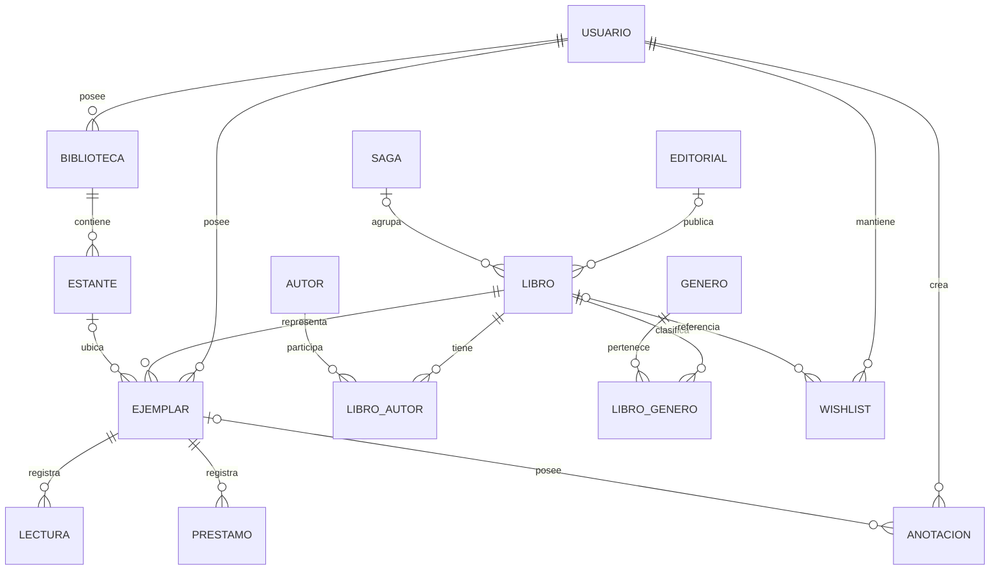

# BookNest - Arquitectura del Sistema

## 1. Introducción

BookNest es una aplicación web orientada a la gestión de bibliotecas personales físicas. Su objetivo es permitir que cada usuario pueda organizar y administrar su colección de libros, registrar la ubicación física de sus ejemplares, realizar un seguimiento de sus lecturas, gestionar préstamos, mantener una lista de deseos y consultar información general sobre su biblioteca.

La presente propuesta define la arquitectura general de BookNest, los módulos que compondrán el sistema y las principales reglas de negocio que deberán respetarse durante su desarrollo. Asimismo, servirá como base para el diseño del modelo de datos y para la posterior implementación de la aplicación.

## 2. Objetivo de la arquitectura

La arquitectura de BookNest busca organizar el sistema mediante una separación clara de responsabilidades, favoreciendo un bajo acoplamiento y una alta cohesión entre sus componentes.

Se propone una arquitectura en capas que permita separar la interfaz de usuario, la lógica de negocio, el acceso a los datos y la persistencia. Esta organización facilitará el mantenimiento, las pruebas y la incorporación de nuevas funcionalidades sin afectar innecesariamente otros componentes del sistema.

Además, la arquitectura contempla la integración con servicios bibliográficos externos para facilitar la carga de información de los libros a partir de su ISBN.

## 3. Arquitectura general del sistema

BookNest utilizará una arquitectura cliente-servidor. El frontend funcionará como cliente y será responsable de presentar la interfaz web y permitir la interacción del usuario con las funcionalidades del sistema.

Las solicitudes realizadas desde el frontend serán enviadas al backend mediante una API REST utilizando HTTP y JSON. El backend, desarrollado con Python y FastAPI, será responsable de procesar las solicitudes, aplicar las reglas de negocio y coordinar el acceso a los datos.

Para la persistencia de la información se utilizará una base de datos relacional MySQL. El acceso a la base de datos se realizará mediante SQLAlchemy como ORM, permitiendo trabajar con las entidades del sistema desde Python y reduciendo el acoplamiento directo con las consultas SQL.

Además, el backend se integrará con una API bibliográfica externa para consultar información de libros a partir del ISBN, permitiendo obtener automáticamente datos como título, autores, editorial, fecha de publicación, sinopsis y portada cuando dicha información se encuentre disponible.

El flujo general de comunicación será:

Usuario → Frontend → API REST → Backend → Base de datos

Cuando sea necesario obtener información bibliográfica externa:

Backend → API bibliográfica externa

## 4. Arquitectura en capas

Para organizar las responsabilidades del sistema, BookNest utilizará una arquitectura en capas. Cada capa tendrá una función específica y se comunicará con las demás de manera controlada, evitando concentrar toda la lógica de la aplicación en un mismo componente.

### 4.1. Capa de presentación

Corresponde al frontend de la aplicación, desarrollado con HTML5, CSS3 y JavaScript.

Será responsable de mostrar la interfaz al usuario, capturar sus acciones y presentar la información recibida desde el backend. No contendrá reglas de negocio ni accederá directamente a la base de datos.

### 4.2. Capa de API o controladores

Estará implementada mediante FastAPI y será el punto de entrada de las solicitudes provenientes del frontend.

Su responsabilidad será recibir las peticiones HTTP, validar los datos de entrada correspondientes, invocar la lógica de negocio necesaria y devolver las respuestas mediante la API REST.

### 4.3. Capa de servicios o lógica de negocio

Contendrá las principales reglas de negocio de BookNest.

Esta capa será responsable de coordinar las operaciones del sistema y aplicar las validaciones correspondientes. Por ejemplo, controlar la capacidad disponible de un estante, impedir que un ejemplar tenga más de un préstamo activo o gestionar la conversión de un elemento de la lista de deseos en un ejemplar adquirido.

### 4.4. Capa de persistencia o acceso a datos

Será responsable de gestionar el acceso a la información almacenada en la base de datos.

Se utilizará SQLAlchemy como ORM para representar y manipular las entidades del sistema desde Python. Esta capa permitirá separar la lógica de negocio de los detalles específicos de persistencia.

### 4.5. Capa de base de datos

La información persistente de BookNest será almacenada en una base de datos relacional MySQL.

En ella se conservarán los datos correspondientes a usuarios, libros, ejemplares, bibliotecas, estantes, lecturas, préstamos, anotaciones, lista de deseos y demás entidades necesarias para el funcionamiento del sistema.

### 4.6. Integraciones externas

Las comunicaciones con servicios externos se mantendrán separadas de la lógica principal del sistema.

Inicialmente, BookNest contará con una integración bibliográfica que permitirá consultar información de libros mediante ISBN. El backend será responsable de realizar estas consultas y transformar la información obtenida antes de utilizarla dentro de la aplicación.

## 5. Módulos del sistema

BookNest se organizará en módulos funcionales con responsabilidades específicas. Esta división busca mantener una alta cohesión dentro de cada módulo y reducir el acoplamiento entre las distintas funcionalidades del sistema.

### Prioridad de implementación

La prioridad indicada a continuación representa el orden de implementación previsto según las dependencias entre los módulos. Todos los módulos enumerados forman parte del alcance funcional definido para el MVP de BookNest.

| Módulo | Descripción | Prioridad |
|---|---|---|
| Usuarios y Autenticación | Gestiona el registro, inicio de sesión, datos de perfil y estado de las cuentas de usuario. | Alta |
| Catálogo de Libros y Ejemplares | Gestiona la información bibliográfica de los libros y las copias físicas pertenecientes a cada usuario. | Alta |
| Bibliotecas y Estantes | Permite organizar físicamente los ejemplares en bibliotecas y estantes configurables, controlando su capacidad. | Alta |
| Lecturas | Registra el estado, fechas, calificaciones y reseñas correspondientes a las distintas lecturas de cada ejemplar. | Media |
| Préstamos | Gestiona los préstamos de ejemplares, destinatarios, fechas y estados de devolución. | Media |
| Wishlist | Permite registrar libros deseados y gestionar su posterior adquisición o descarte. | Media |
| Anotaciones | Permite crear y administrar anotaciones generales o asociadas a un ejemplar. | Media |
| Integración bibliográfica | Obtiene información bibliográfica y portadas desde servicios externos para facilitar la carga de libros. | Media |
| Dashboard | Presenta indicadores y estadísticas construidos a partir de la información registrada en los demás módulos. | Baja |

Las prioridades no indican que los módulos de prioridad media o baja sean opcionales. Se utilizan únicamente para establecer una secuencia de desarrollo: primero se implementarán los módulos estructurales de los que dependen las funcionalidades posteriores.

### 5.1. Módulo de Usuarios y Autenticación

Será responsable de la gestión de las cuentas de usuario y del acceso seguro al sistema.

Permitirá el registro, inicio y cierre de sesión, modificación de los datos personales y cambio de contraseña. Cada usuario tendrá acceso únicamente a la información correspondiente a su propia biblioteca.

La eliminación de una cuenta se manejará mediante baja lógica, conservando la información relacionada para mantener la integridad de los datos. La recuperación de contraseña mediante correo electrónico se considera una funcionalidad futura y no formará parte del MVP.

### 5.2. Módulo de Catálogo de Libros y Ejemplares

Será responsable de la administración de los libros que forman parte de la colección del usuario.

El sistema diferenciará entre Libro y Ejemplar. Libro representará la información bibliográfica correspondiente a una edición, mientras que Ejemplar representará una copia física concreta perteneciente al usuario. De esta manera, un mismo libro podrá estar asociado a varios ejemplares físicos.

Permitirá registrar, consultar, modificar y dar de baja ejemplares, además de realizar búsquedas, aplicar filtros y ordenar la colección utilizando distintos criterios.

### 5.3. Módulo de Wishlist

Permitirá administrar los libros que el usuario desea adquirir.

Los elementos de la lista de deseos podrán registrarse manualmente o mediante una consulta por ISBN. Cada elemento podrá encontrarse en estado PENDIENTE, ADQUIRIDO o DESCARTADO.

Cuando un elemento sea marcado como ADQUIRIDO, se generará el ejemplar correspondiente dentro de la biblioteca personal del usuario. El nuevo ejemplar quedará inicialmente sin ubicación física asignada y con una lectura en estado PENDIENTE.

### 5.4. Módulo de Bibliotecas y Estantes

Será responsable de representar digitalmente la organización física de la colección.

El usuario podrá crear diferentes bibliotecas o espacios de almacenamiento y, dentro de cada una, definir sus respectivos estantes. Cada estante contará con una capacidad máxima expresada en cantidad de ejemplares.

El sistema controlará la ocupación de los estantes y permitirá identificar ejemplares con o sin ubicación asignada.

### 5.5. Módulo de Lecturas

Permitirá registrar y consultar el historial de lectura de cada ejemplar.

Cada ejemplar podrá tener múltiples lecturas a lo largo del tiempo, permitiendo registrar relecturas sin eliminar la información anterior. Las lecturas podrán encontrarse en estado PENDIENTE, EN_CURSO, LEIDO o ABANDONADO.

También podrán registrarse fechas de inicio y finalización, una calificación opcional de una a cinco estrellas y una reseña. Cuando ambas fechas estén disponibles, la duración de la lectura podrá calcularse automáticamente.

### 5.6. Módulo de Anotaciones

Permitirá almacenar anotaciones privadas del usuario.

Se contemplarán anotaciones generales, similares a un bloc de notas o post-it, y anotaciones asociadas a un ejemplar específico. Las anotaciones podrán crearse, modificarse y eliminarse.

Las anotaciones vinculadas a un ejemplar serán independientes de sus lecturas, por lo que no se asociarán a una lectura particular ni se compartirán automáticamente con otros ejemplares del mismo libro.

### 5.7. Módulo de Préstamos

Será responsable de registrar y controlar los préstamos de ejemplares físicos a terceros.

Cada préstamo almacenará los datos básicos de la persona que recibe el ejemplar, la fecha del préstamo, una fecha prevista de devolución opcional y, cuando corresponda, la fecha real de devolución.

Los préstamos podrán encontrarse en estado ACTIVO, VENCIDO, DEVUELTO o CANCELADO. Un mismo ejemplar podrá tener múltiples préstamos históricos, pero solamente uno podrá permanecer activo al mismo tiempo.

### 5.8. Módulo de Dashboard y Estadísticas

Permitirá visualizar un resumen general de la biblioteca personal del usuario.

El dashboard podrá mostrar la cantidad total de ejemplares, estados de lectura, préstamos activos o vencidos, ejemplares con o sin ubicación y distribuciones por género, autor, editorial y saga.

También podrá presentar anotaciones generales y actividad reciente, manteniendo el alcance como un panel resumen de la colección.

### 5.9. Módulo de Integración Bibliográfica

Será responsable de la comunicación con servicios bibliográficos externos.

Permitirá consultar información a partir de un ISBN para facilitar la carga de libros y obtener automáticamente los datos disponibles, como título, autores, editorial, fecha de publicación, sinopsis y portada.

La información obtenida podrá ser revisada o completada por el usuario antes de incorporarse al sistema.

## 6. Reglas de negocio

Las siguientes reglas definen las condiciones que deberán respetarse durante el funcionamiento de BookNest. Estas reglas serán aplicadas principalmente desde la capa de servicios y deberán ser consideradas también al diseñar el modelo de datos y sus restricciones.

### 6.1. Usuarios

- Cada usuario deberá registrarse con un correo electrónico único.
- La contraseña nunca se almacenará en texto plano, sino mediante un mecanismo seguro de hash.
- Cada usuario solamente podrá acceder y administrar los datos correspondientes a su propia cuenta y biblioteca personal.
- Un usuario autenticado podrá modificar su nombre, apellido, correo electrónico y contraseña.
- Al modificar el correo electrónico, deberá verificarse que no se encuentre registrado por otro usuario.
- Para cambiar la contraseña se solicitará la contraseña actual.
- La eliminación de la cuenta se realizará mediante baja lógica. La cuenta quedará inactiva y no podrá utilizarse para iniciar sesión.
- La recuperación de contraseña mediante correo electrónico no formará parte del MVP y quedará contemplada como funcionalidad futura.

### 6.2. Libros y ejemplares

- BookNest diferenciará entre Libro y Ejemplar.
- Libro representará los datos bibliográficos correspondientes a una edición, mientras que Ejemplar representará una copia física concreta perteneciente a un usuario.
- Un mismo Libro podrá estar asociado a múltiples Ejemplares.
- El ISBN identificará una edición bibliográfica y no un ejemplar físico individual.
- La carga manual de un Libro requerirá como mínimo un título y al menos un autor.
- El ISBN, editorial, fecha de publicación, géneros, saga, posición dentro de la saga, sinopsis y portada serán datos opcionales en una carga manual.
- Un Libro podrá tener uno o varios autores.
- Un Libro podrá pertenecer a uno o varios géneros.
- Un Libro podrá estar asociado a una editorial.
- Un Libro podrá pertenecer opcionalmente a una saga o serie y registrar su posición dentro de ella.
- Cada Ejemplar podrá registrar de manera opcional su fecha de adquisición, estado físico, precio de compra, moneda y una observación.
- La ubicación física de un Ejemplar será opcional.
- Un Ejemplar podrá existir sin estar asignado a ningún estante.
- La baja de un Ejemplar será lógica, con el objetivo de conservar la integridad y el historial de la información.
- No podrá darse de baja un Ejemplar mientras posea un préstamo activo.

### 6.3. Wishlist

- Cada usuario tendrá su propia lista de deseos.
- Los elementos de la Wishlist podrán registrarse manualmente o mediante una consulta bibliográfica por ISBN.
- La carga manual podrá realizarse aun cuando el usuario no conozca el ISBN.
- Un elemento de la Wishlist podrá encontrarse en estado PENDIENTE, ADQUIRIDO o DESCARTADO.
- Si se ingresa un ISBN que ya se encuentra en la Wishlist del usuario, el sistema no permitirá generar un elemento duplicado.
- Si el ISBN corresponde a un Libro del cual el usuario ya posee un Ejemplar, el sistema mostrará una advertencia, pero permitirá incorporarlo a la Wishlist, ya que el usuario podría querer adquirir otra copia.
- Cuando un elemento sea cargado manualmente sin ISBN, el sistema podrá advertir sobre posibles coincidencias de título y autor, pero no bloqueará su incorporación.
- Un elemento de la Wishlist podrá representar tanto un libro deseado de forma genérica como una edición específica identificada mediante ISBN.
- Al marcar un elemento como ADQUIRIDO, se generará un Ejemplar dentro de la biblioteca personal del usuario.
- El nuevo Ejemplar se creará inicialmente sin ubicación física asignada.
- Al generarse el nuevo Ejemplar, se creará una Lectura inicial en estado PENDIENTE.
- Si el elemento de la Wishlist no poseía un ISBN específico, al momento de adquirirlo el usuario podrá completar o confirmar los datos de la edición finalmente adquirida.
- Los elementos marcados como ADQUIRIDO o DESCARTADO se conservarán como historial y no serán eliminados automáticamente.

### 6.4. Bibliotecas y estantes

- Cada usuario podrá crear múltiples Bibliotecas o espacios físicos de almacenamiento.
- El nombre de una Biblioteca deberá ser único dentro de la cuenta del usuario.
- Cada Biblioteca podrá contener múltiples Estantes.
- El nombre de un Estante deberá ser único dentro de su Biblioteca, aunque podrá repetirse en Bibliotecas diferentes.
- Cada Estante tendrá una capacidad máxima definida en cantidad de Ejemplares.
- Cada Ejemplar ubicado físicamente ocupará una unidad de capacidad.
- La capacidad de un Estante podrá modificarse posteriormente.
- No se permitirá reducir la capacidad de un Estante por debajo de la cantidad de Ejemplares que se encuentren actualmente ubicados en él.
- Cuando un Estante alcance su capacidad máxima, no podrán asignarse nuevos Ejemplares hasta que exista espacio disponible o se aumente su capacidad.
- La asignación de un Ejemplar a una Biblioteca y Estante será opcional.
- Los Ejemplares sin ubicación permanecerán identificados como "Sin ubicación asignada".
- BookNest conservará únicamente la ubicación física actual del Ejemplar y no mantendrá un historial de movimientos entre Estantes.
- Para eliminar un Estante que contenga Ejemplares, el usuario deberá previamente trasladarlos a otro Estante con capacidad disponible o dejarlos sin ubicación asignada.
- Para eliminar una Biblioteca que contenga Ejemplares, deberá aplicarse el mismo criterio, reubicando los Ejemplares o dejándolos sin ubicación antes de completar la eliminación.

### 6.5. Lecturas

- Cada Lectura estará asociada a un Ejemplar específico.
- Cada Ejemplar podrá tener múltiples Lecturas, permitiendo registrar relecturas sin modificar ni eliminar las anteriores.
- Al crear un nuevo Ejemplar, se generará automáticamente una primera Lectura en estado PENDIENTE.
- Una Lectura podrá encontrarse en estado PENDIENTE, EN_CURSO, LEIDO o ABANDONADO.
- Las fechas de inicio y finalización serán opcionales.
- Si una Lectura posee fecha de inicio y fecha de finalización, BookNest podrá calcular automáticamente la cantidad de días que tomó completar la lectura.
- La duración de una Lectura será un dato calculado y no se almacenará de forma redundante.
- Cada Lectura podrá tener una calificación opcional de 1 a 5 estrellas.
- La calificación solamente admitirá valores enteros comprendidos entre 1 y 5.
- Cada Lectura podrá incluir una reseña opcional.
- Las diferentes Lecturas de un mismo Ejemplar podrán tener calificaciones y reseñas diferentes.
- BookNest podrá calcular el promedio de las calificaciones correspondientes a las Lecturas de un Ejemplar.
- El promedio de calificaciones será un valor calculado y no se almacenará como un dato independiente.

### 6.6. Anotaciones

- BookNest permitirá crear anotaciones generales y anotaciones asociadas a un Ejemplar.
- Las anotaciones generales funcionarán como notas personales simples o "post-it" del usuario y no estarán asociadas a ningún libro.
- Una anotación general podrá contener un título opcional y un contenido.
- Se registrará la fecha de creación y la fecha de última modificación de las anotaciones.
- El usuario podrá crear, modificar y eliminar sus anotaciones.
- Un Ejemplar podrá tener múltiples anotaciones asociadas.
- Las anotaciones de un Ejemplar serán independientes de sus Lecturas.
- Una anotación no deberá estar asociada a una Lectura específica.
- Si el usuario posee más de un Ejemplar correspondiente al mismo Libro, las anotaciones de cada Ejemplar se mantendrán independientes y no se compartirán automáticamente.
- La información relacionada específicamente con el estado físico de una copia podrá registrarse mediante la observación del Ejemplar, evitando utilizar las anotaciones para ese propósito.

### 6.7. Préstamos

- Cada Préstamo estará asociado a un Ejemplar físico específico.
- Un Ejemplar podrá tener múltiples Préstamos a lo largo del tiempo, conservando su historial.
- Un mismo Ejemplar solamente podrá tener un Préstamo activo a la vez.
- No será necesario que la persona que recibe el libro tenga una cuenta en BookNest.
- Para cada Préstamo se registrarán directamente el nombre y apellido de la persona que recibe el Ejemplar.
- El teléfono y el correo electrónico del destinatario serán datos opcionales.
- La fecha de realización del Préstamo será obligatoria.
- La fecha prevista de devolución será opcional.
- Al registrarse la devolución se almacenará la fecha real de devolución.
- Un Préstamo podrá encontrarse en estado ACTIVO, VENCIDO, DEVUELTO o CANCELADO.
- Si existe una fecha prevista de devolución y esta es superada mientras el Ejemplar continúa prestado, el Préstamo se considerará VENCIDO.
- Si no se indicó una fecha prevista de devolución, el Préstamo permanecerá ACTIVO hasta que se registre su devolución o cancelación.
- El estado CANCELADO permitirá anular un Préstamo registrado por error sin eliminar físicamente su historial.
- Un Ejemplar podrá ser prestado aunque no tenga una ubicación física asignada.
- Mientras un Ejemplar se encuentre prestado, dejará de contabilizarse dentro de la ocupación física de su Estante, liberando ese espacio para otro Ejemplar.
- La ubicación anterior podrá conservarse como referencia para el momento de la devolución, pero el espacio no quedará reservado.
- Al registrar la devolución, el usuario deberá decidir nuevamente la ubicación física del Ejemplar.
- El Ejemplar podrá regresar a su ubicación anterior únicamente si el Estante dispone de capacidad.
- Si la ubicación anterior ya no tiene capacidad disponible, el usuario deberá seleccionar otro Estante o dejar el Ejemplar sin ubicación asignada.
- No podrá darse de baja un Ejemplar mientras posea un Préstamo activo o vencido sin resolver.

### 6.8. Búsqueda, filtros y ordenamiento

- El usuario podrá buscar elementos de su colección por título, autor o ISBN.
- El catálogo permitirá aplicar filtros por género, autor, editorial y saga.
- También podrán aplicarse filtros según el estado de lectura del Ejemplar.
- Se podrá filtrar por Biblioteca y Estante.
- El sistema permitirá diferenciar entre Ejemplares con ubicación física asignada y Ejemplares sin ubicación.
- Se podrá filtrar según el estado de préstamo del Ejemplar.
- También podrá utilizarse el estado físico del Ejemplar como criterio de filtrado.
- Los resultados podrán ordenarse por título, autor y fecha de adquisición.
- Los filtros y criterios de ordenamiento podrán utilizarse para facilitar la localización y consulta de los Ejemplares de una colección.

### 6.9. Dashboard y estadísticas

- Cada usuario visualizará únicamente estadísticas correspondientes a su propia colección.
- El Dashboard podrá mostrar la cantidad total de Ejemplares registrados.
- Se mostrará un resumen de Ejemplares según sus estados de lectura: PENDIENTE, EN_CURSO, LEIDO y ABANDONADO.
- Se podrán visualizar la cantidad de Préstamos activos y vencidos.
- Se podrá mostrar la cantidad de Ejemplares con ubicación física asignada y sin ubicación.
- El Dashboard podrá presentar la distribución de la colección por género, autor, editorial y saga.
- Podrán mostrarse las anotaciones generales del usuario a modo de notas o "post-it".
- El Dashboard podrá incluir información sobre actividad reciente, como últimas adquisiciones o Lecturas registradas.
- Las estadísticas se obtendrán a partir de los datos existentes en el sistema, evitando almacenar de forma redundante valores que puedan calcularse.

### 6.10. Integración bibliográfica y portadas

- El usuario podrá registrar un Libro manualmente o realizar una búsqueda mediante ISBN.
- Cuando se utilice un ISBN, el backend consultará un servicio bibliográfico externo para intentar obtener los metadatos disponibles.
- Los datos recuperados podrán incluir título, autores, editorial, fecha de publicación, géneros, sinopsis y portada, según la disponibilidad de la API utilizada.
- La información obtenida automáticamente podrá ser revisada y completada por el usuario antes de incorporarse al sistema.
- Si la API devuelve una portada, BookNest la utilizará inicialmente como imagen del Libro.
- Si no existe una portada disponible, se mostrará una imagen genérica de BookNest.
- El usuario podrá cargar una portada propia o reemplazar la portada obtenida automáticamente.
- La ausencia de información en el servicio bibliográfico externo no impedirá la carga manual del Libro.

## 7. Alcance y decisiones de diseño del MVP

Con el objetivo de mantener un alcance viable para la primera versión de BookNest, se definieron las siguientes decisiones de diseño:

- BookNest estará orientado inicialmente a la gestión de libros físicos. La administración de libros digitales no formará parte del MVP.
- Las funcionalidades sociales, como amigos, recomendaciones entre usuarios, comentarios públicos o interacción entre perfiles, se consideran funcionalidades futuras.
- La recuperación de contraseña mediante correo electrónico se implementará en una etapa posterior.
- Los destinatarios de los préstamos no deberán registrarse como usuarios de BookNest ni se administrará una agenda independiente de contactos. Sus datos básicos se almacenarán directamente en cada Préstamo.
- No se conservará un historial de movimientos físicos de los Ejemplares entre Bibliotecas y Estantes. Solamente será relevante su ubicación actual.
- La capacidad de los Estantes se expresará en cantidad de Ejemplares y no mediante dimensiones físicas o medidas de los libros.
- No se reservará el espacio de un Estante cuando un Ejemplar se encuentre prestado.
- Los valores que puedan obtenerse mediante cálculos, como el promedio de calificaciones, la duración de una Lectura o la ocupación de un Estante, se calcularán a partir de los datos existentes siempre que resulte conveniente, evitando información redundante.
- Las notificaciones automáticas por correo electrónico, incluyendo recordatorios de préstamos vencidos, quedarán contempladas como una mejora futura.
- Las funcionalidades futuras podrán incorporarse de forma progresiva aprovechando la separación por módulos y capas definida para el sistema.

## 8. Modelo de datos

BookNest utilizará una base de datos relacional MySQL para almacenar de forma persistente la información del sistema. El modelo de datos fue diseñado a partir de los módulos y reglas de negocio definidos para el MVP, buscando mantener la integridad de la información, reducir la redundancia y representar correctamente las relaciones entre las distintas entidades.

Una de las principales decisiones del modelo consiste en diferenciar Libro de Ejemplar. Libro representará la información bibliográfica correspondiente a una edición, mientras que Ejemplar representará una copia física concreta perteneciente a un usuario. De esta manera, diferentes usuarios o incluso un mismo usuario podrán poseer distintos ejemplares asociados a una misma edición bibliográfica.

El modelo también contemplará autores, géneros, editoriales, sagas, bibliotecas físicas, estantes, lecturas, préstamos, anotaciones y elementos de la lista de deseos.

Las relaciones entre las entidades se implementarán mediante claves primarias y foráneas. En los casos donde exista una relación muchos a muchos se utilizarán tablas asociativas para mantener un modelo relacional normalizado.

## 9. Entidades principales

### 9.1. Usuario

Representa a una persona registrada en BookNest. Cada usuario administrará de manera independiente su colección, bibliotecas, ejemplares, wishlist y anotaciones.

Sus principales atributos serán:

- `id`: identificador único del usuario.
- `nombre`: nombre del usuario.
- `apellido`: apellido del usuario.
- `email`: correo electrónico utilizado para iniciar sesión. Deberá ser único.
- `password_hash`: contraseña almacenada mediante un mecanismo seguro de hash.
- `fecha_registro`: fecha de creación de la cuenta.
- `estado`: indica si la cuenta se encuentra ACTIVA o INACTIVA.

La eliminación de una cuenta se manejará mediante baja lógica, por lo que el registro no será eliminado físicamente de la base de datos.

### 9.2. Libro

Representa la información bibliográfica correspondiente a una edición de un libro. No representa una copia física particular perteneciente a un usuario.

Sus principales atributos serán:

- `id`: identificador único del libro.
- `titulo`: título de la obra.
- `isbn`: ISBN correspondiente a la edición. Será opcional para permitir cargas manuales cuando el usuario no disponga de este dato.
- `fecha_publicacion`: fecha de publicación de la edición, cuando se encuentre disponible.
- `sinopsis`: descripción o resumen del libro.
- `portada_url`: referencia a la imagen utilizada como portada.
- `editorial_id`: referencia opcional a la editorial correspondiente.
- `saga_id`: referencia opcional a una saga o serie.
- `posicion_saga`: posición del libro dentro de la saga, cuando corresponda.

Un Libro podrá tener múltiples autores y múltiples géneros. Estas relaciones se representarán mediante las tablas asociativas `LibroAutor` y `LibroGenero`.

### 9.3. Autor

Representa a un autor asociado a uno o varios libros.

Sus principales atributos serán:

- `id`: identificador único del autor.
- `nombre`: nombre del autor.

La relación entre Libro y Autor será de muchos a muchos, ya que un libro puede tener varios autores y un mismo autor puede participar en varios libros.

### 9.4. LibroAutor

Será la entidad asociativa utilizada para representar la relación muchos a muchos entre Libro y Autor.

Sus atributos serán:

- `libro_id`: referencia al Libro.
- `autor_id`: referencia al Autor.

La combinación de ambos identificadores será única, evitando registrar dos veces al mismo autor para un mismo libro.

### 9.5. Genero

Representa los géneros mediante los cuales pueden clasificarse los libros.

Sus principales atributos serán:

- `id`: identificador único del género.
- `nombre`: nombre del género.

Un Libro podrá pertenecer a varios géneros y un mismo género podrá contener múltiples libros.

### 9.6. LibroGenero

Será la entidad asociativa utilizada para representar la relación muchos a muchos entre Libro y Genero.

Sus atributos serán:

- `libro_id`: referencia al Libro.
- `genero_id`: referencia al Genero.

La combinación de ambos identificadores será única para evitar asociaciones duplicadas.

### 9.7. Editorial

Representa una editorial responsable de la publicación de una o varias ediciones bibliográficas.

Sus principales atributos serán:

- `id`: identificador único de la editorial.
- `nombre`: nombre de la editorial.

Una Editorial podrá estar asociada a múltiples Libros. La asociación de un Libro con una Editorial será opcional.

### 9.8. Saga

Representa una saga o serie a la cual pueden pertenecer diferentes libros.

Sus principales atributos serán:

- `id`: identificador único de la saga.
- `nombre`: nombre de la saga.

Una Saga podrá contener múltiples Libros. La pertenencia de un Libro a una Saga será opcional y, cuando corresponda, el Libro podrá registrar su posición dentro de ella.

### 9.9. Ejemplar

Representa una copia física concreta de un Libro perteneciente a un usuario.

Sus principales atributos serán:

- `id`: identificador único del ejemplar.
- `usuario_id`: referencia al usuario propietario.
- `libro_id`: referencia al Libro correspondiente.
- `estante_id`: referencia opcional al Estante donde se encuentra ubicado.
- `fecha_adquisicion`: fecha opcional en la que fue adquirido.
- `estado_fisico`: estado de conservación del ejemplar.
- `precio_compra`: precio de adquisición, cuando el usuario desee registrarlo.
- `moneda`: moneda correspondiente al precio de compra.
- `observacion`: observación opcional relacionada con la copia física.
- `activo`: indica si el ejemplar se encuentra activo o fue dado de baja lógicamente.

Los posibles estados físicos serán NUEVO, MUY_BUENO, BUENO, REGULAR y DETERIORADO.

Un mismo Libro podrá estar asociado a múltiples Ejemplares. Esto permitirá que un usuario pueda poseer más de una copia física correspondiente a la misma edición o ISBN.

La ubicación física será opcional, por lo que `estante_id` podrá permanecer sin valor cuando el Ejemplar se encuentre sin ubicación asignada.

### 9.10. Biblioteca

Representa un espacio físico de almacenamiento creado por un usuario para organizar sus libros.

Sus principales atributos serán:

- `id`: identificador único de la biblioteca.
- `usuario_id`: referencia al usuario propietario.
- `nombre`: nombre asignado por el usuario.

Un usuario podrá crear múltiples Bibliotecas. El nombre de una Biblioteca deberá ser único dentro de la cuenta de cada usuario.

### 9.11. Estante

Representa una división física dentro de una Biblioteca.

Sus principales atributos serán:

- `id`: identificador único del estante.
- `biblioteca_id`: referencia a la Biblioteca a la cual pertenece.
- `nombre`: nombre asignado al estante.
- `capacidad`: cantidad máxima de Ejemplares que pueden encontrarse físicamente en él.

Una Biblioteca podrá contener múltiples Estantes.

El nombre de un Estante deberá ser único dentro de una misma Biblioteca, aunque podrá repetirse en Bibliotecas diferentes.

La ocupación actual no se almacenará como un atributo independiente, ya que podrá calcularse a partir de los Ejemplares que se encuentren físicamente ubicados en el Estante.

### 9.12. Lectura

Representa una experiencia de lectura correspondiente a un Ejemplar específico.

Sus principales atributos serán:

- `id`: identificador único de la lectura.
- `ejemplar_id`: referencia al Ejemplar leído.
- `estado`: estado actual de la lectura.
- `fecha_inicio`: fecha opcional de inicio.
- `fecha_fin`: fecha opcional de finalización.
- `calificacion`: valoración opcional mediante un número entero de 1 a 5.
- `resena`: reseña opcional correspondiente a esa lectura.

Los estados posibles serán PENDIENTE, EN_CURSO, ABANDONADO y LEIDO.

Un Ejemplar podrá tener múltiples Lecturas, permitiendo conservar las diferentes relecturas realizadas a lo largo del tiempo.

La duración de una Lectura no se almacenará como atributo independiente, ya que podrá calcularse cuando existan fecha de inicio y fecha de finalización.

Del mismo modo, los promedios de calificaciones se calcularán a partir de las Lecturas existentes y no se almacenarán de manera redundante.

### 9.13. Prestamo

Representa el préstamo de un Ejemplar físico a una persona externa.

Sus principales atributos serán:

- `id`: identificador único del préstamo.
- `ejemplar_id`: referencia al Ejemplar prestado.
- `nombre_destinatario`: nombre de la persona que recibe el ejemplar.
- `apellido_destinatario`: apellido de la persona que recibe el ejemplar.
- `telefono_destinatario`: teléfono opcional del destinatario.
- `email_destinatario`: correo electrónico opcional del destinatario.
- `fecha_prestamo`: fecha en la que se realiza el préstamo.
- `fecha_prevista_devolucion`: fecha opcional acordada para la devolución.
- `fecha_devolucion`: fecha real de devolución, cuando corresponda.
- `estado`: estado actual del préstamo.

Los estados posibles serán ACTIVO, VENCIDO, DEVUELTO y CANCELADO.

Un Ejemplar podrá tener múltiples Préstamos históricos, pero no podrá poseer más de un préstamo activo al mismo tiempo.

No se creará una entidad independiente para los destinatarios de los préstamos, ya que los datos necesarios se almacenarán directamente en cada Préstamo.

### 9.14. Anotacion

Representa una nota privada creada por el usuario.

Sus principales atributos serán:

- `id`: identificador único de la anotación.
- `usuario_id`: referencia al usuario propietario de la anotación.
- `ejemplar_id`: referencia opcional al Ejemplar relacionado.
- `titulo`: título opcional de la anotación.
- `contenido`: contenido de la nota.
- `fecha_creacion`: fecha de creación.
- `fecha_modificacion`: fecha de la última modificación.

Cuando `ejemplar_id` no posea un valor, la anotación será considerada una anotación general o post-it del usuario.

Cuando `ejemplar_id` haga referencia a un Ejemplar, la anotación estará asociada exclusivamente a esa copia física.

Las anotaciones no se asociarán a una Lectura particular. Por este motivo, diferentes relecturas de un mismo Ejemplar podrán compartir las anotaciones pertenecientes a ese Ejemplar sin modificar el historial de cada Lectura.

### 9.15. Wishlist

Representa un elemento incorporado por el usuario a su lista de deseos.

Sus principales atributos serán:

- `id`: identificador único del elemento.
- `usuario_id`: referencia al usuario propietario de la Wishlist.
- `libro_id`: referencia opcional a un Libro cuando se conoce una edición bibliográfica concreta.
- `titulo`: título del libro deseado.
- `autor_referencia`: autor o autores informados como referencia cuando todavía no existe una edición bibliográfica asociada.
- `isbn`: ISBN opcional cuando el usuario desea una edición específica.
- `estado`: estado del elemento dentro de la Wishlist.
- `fecha_creacion`: fecha en la que el elemento fue incorporado.

Los estados posibles serán PENDIENTE, ADQUIRIDO y DESCARTADO.

La referencia a Libro será opcional porque un usuario podrá agregar a su Wishlist un libro de forma genérica, sin conocer todavía la edición o ISBN que finalmente adquirirá.

Cuando se conozca una edición específica, el elemento podrá vincularse con el Libro correspondiente.

Al marcar un elemento como ADQUIRIDO, el registro de Wishlist se conservará como parte del historial y se generará el Ejemplar físico correspondiente.

## 10. Relaciones y cardinalidades

Las entidades de BookNest se relacionarán de acuerdo con las necesidades funcionales y las reglas de negocio definidas para el sistema.

Las principales relaciones serán:

- **Usuario 1:N Biblioteca:** un usuario podrá crear múltiples Bibliotecas, mientras que cada Biblioteca pertenecerá a un único usuario.
- **Biblioteca 1:N Estante:** una Biblioteca podrá contener múltiples Estantes y cada Estante pertenecerá a una única Biblioteca.
- **Usuario 1:N Ejemplar:** un usuario podrá poseer múltiples Ejemplares y cada Ejemplar pertenecerá a un único usuario.
- **Libro 1:N Ejemplar:** un Libro podrá estar asociado a múltiples copias físicas, mientras que cada Ejemplar corresponderá a un único Libro.
- **Estante 1:N Ejemplar:** un Estante podrá contener múltiples Ejemplares. La relación será opcional desde Ejemplar, ya que una copia podrá encontrarse sin ubicación asignada.
- **Editorial 1:N Libro:** una Editorial podrá publicar múltiples Libros. La asociación será opcional desde Libro.
- **Saga 1:N Libro:** una Saga podrá contener múltiples Libros. La asociación será opcional desde Libro.
- **Libro N:M Autor:** un Libro podrá tener múltiples Autores y un Autor podrá estar asociado a múltiples Libros. La relación se resolverá mediante LibroAutor.
- **Libro N:M Genero:** un Libro podrá pertenecer a múltiples Géneros y un Género podrá contener múltiples Libros. La relación se resolverá mediante LibroGenero.
- **Ejemplar 1:N Lectura:** un Ejemplar podrá registrar múltiples Lecturas o relecturas.
- **Ejemplar 1:N Prestamo:** un Ejemplar podrá registrar múltiples Préstamos históricos.
- **Usuario 1:N Anotacion:** un usuario podrá crear múltiples Anotaciones.
- **Ejemplar 1:N Anotacion:** un Ejemplar podrá tener múltiples Anotaciones. La relación será opcional desde Anotacion para permitir notas generales.
- **Usuario 1:N Wishlist:** un usuario podrá registrar múltiples elementos en su lista de deseos.
- **Libro 1:N Wishlist:** un Libro podrá ser referenciado por diferentes elementos de Wishlist. La asociación será opcional desde Wishlist.

Las relaciones opcionales permitirán representar correctamente situaciones como Ejemplares sin ubicación física, Libros sin Editorial o Saga informada, anotaciones generales y elementos de Wishlist sin una edición bibliográfica definida.

## 11. Diccionario de datos

### 11.1. Usuario

| Campo | Tipo | Restricciones | Descripción |
|---|---|---|---|
| id | BIGINT | PK, autoincremental | Identificador único |
| nombre | VARCHAR(100) | NOT NULL | Nombre del usuario |
| apellido | VARCHAR(100) | NOT NULL | Apellido del usuario |
| email | VARCHAR(255) | NOT NULL, UNIQUE | Correo utilizado para autenticación |
| password_hash | VARCHAR(255) | NOT NULL | Hash de la contraseña |
| fecha_registro | DATETIME | NOT NULL | Fecha de creación de la cuenta |
| estado | VARCHAR(20) | NOT NULL | Estado ACTIVA o INACTIVA |

### 11.2. Libro

| Campo | Tipo | Restricciones | Descripción |
|---|---|---|---|
| id | BIGINT | PK, autoincremental | Identificador único |
| titulo | VARCHAR(255) | NOT NULL | Título del libro |
| isbn | VARCHAR(20) | NULL | ISBN de la edición |
| fecha_publicacion | DATE | NULL | Fecha de publicación |
| sinopsis | TEXT | NULL | Sinopsis del libro |
| portada_url | VARCHAR(500) | NULL | Referencia a la portada |
| editorial_id | BIGINT | FK, NULL | Editorial de la edición |
| saga_id | BIGINT | FK, NULL | Saga a la que pertenece |
| posicion_saga | DECIMAL(5,2) | NULL | Posición dentro de la saga |

### 11.3. Autor

| Campo | Tipo | Restricciones | Descripción |
|---|---|---|---|
| id | BIGINT | PK, autoincremental | Identificador único |
| nombre | VARCHAR(255) | NOT NULL | Nombre del autor |

### 11.4. LibroAutor

| Campo | Tipo | Restricciones | Descripción |
|---|---|---|---|
| libro_id | BIGINT | PK, FK | Referencia al Libro |
| autor_id | BIGINT | PK, FK | Referencia al Autor |

### 11.5. Genero

| Campo | Tipo | Restricciones | Descripción |
|---|---|---|---|
| id | BIGINT | PK, autoincremental | Identificador único |
| nombre | VARCHAR(100) | NOT NULL | Nombre del género |

### 11.6. LibroGenero

| Campo | Tipo | Restricciones | Descripción |
|---|---|---|---|
| libro_id | BIGINT | PK, FK | Referencia al Libro |
| genero_id | BIGINT | PK, FK | Referencia al Género |

### 11.7. Editorial

| Campo | Tipo | Restricciones | Descripción |
|---|---|---|---|
| id | BIGINT | PK, autoincremental | Identificador único |
| nombre | VARCHAR(255) | NOT NULL | Nombre de la editorial |

### 11.8. Saga

| Campo | Tipo | Restricciones | Descripción |
|---|---|---|---|
| id | BIGINT | PK, autoincremental | Identificador único |
| nombre | VARCHAR(255) | NOT NULL | Nombre de la saga |

### 11.9. Ejemplar

| Campo | Tipo | Restricciones | Descripción |
|---|---|---|---|
| id | BIGINT | PK, autoincremental | Identificador del ejemplar |
| usuario_id | BIGINT | FK, NOT NULL | Usuario propietario |
| libro_id | BIGINT | FK, NOT NULL | Edición bibliográfica |
| estante_id | BIGINT | FK, NULL | Ubicación física actual |
| fecha_adquisicion | DATE | NULL | Fecha de adquisición |
| estado_fisico | VARCHAR(20) | NULL | Estado de conservación |
| precio_compra | DECIMAL(10,2) | NULL | Precio de adquisición |
| moneda | VARCHAR(10) | NULL | Moneda del precio |
| observacion | TEXT | NULL | Observaciones de la copia |
| activo | BOOLEAN | NOT NULL | Indica si el ejemplar está activo |

### 11.10. Biblioteca

| Campo | Tipo | Restricciones | Descripción |
|---|---|---|---|
| id | BIGINT | PK, autoincremental | Identificador único |
| usuario_id | BIGINT | FK, NOT NULL | Usuario propietario |
| nombre | VARCHAR(100) | NOT NULL | Nombre de la biblioteca |

### 11.11. Estante

| Campo | Tipo | Restricciones | Descripción |
|---|---|---|---|
| id | BIGINT | PK, autoincremental | Identificador único |
| biblioteca_id | BIGINT | FK, NOT NULL | Biblioteca a la que pertenece |
| nombre | VARCHAR(100) | NOT NULL | Nombre del estante |
| capacidad | INT | NOT NULL | Cantidad máxima de ejemplares |

### 11.12. Lectura

| Campo | Tipo | Restricciones | Descripción |
|---|---|---|---|
| id | BIGINT | PK, autoincremental | Identificador único |
| ejemplar_id | BIGINT | FK, NOT NULL | Ejemplar leído |
| estado | VARCHAR(20) | NOT NULL | Estado de la lectura |
| fecha_inicio | DATE | NULL | Inicio de la lectura |
| fecha_fin | DATE | NULL | Finalización de la lectura |
| calificacion | TINYINT | NULL | Valoración de 1 a 5 |
| resena | TEXT | NULL | Reseña de la lectura |

### 11.13. Prestamo

| Campo | Tipo | Restricciones | Descripción |
|---|---|---|---|
| id | BIGINT | PK, autoincremental | Identificador único |
| ejemplar_id | BIGINT | FK, NOT NULL | Ejemplar prestado |
| nombre_destinatario | VARCHAR(100) | NOT NULL | Nombre del destinatario |
| apellido_destinatario | VARCHAR(100) | NOT NULL | Apellido del destinatario |
| telefono_destinatario | VARCHAR(50) | NULL | Teléfono opcional |
| email_destinatario | VARCHAR(255) | NULL | Correo opcional |
| fecha_prestamo | DATE | NOT NULL | Fecha del préstamo |
| fecha_prevista_devolucion | DATE | NULL | Fecha esperada de devolución |
| fecha_devolucion | DATE | NULL | Fecha real de devolución |
| estado | VARCHAR(20) | NOT NULL | Estado del préstamo |

### 11.14. Anotacion

| Campo | Tipo | Restricciones | Descripción |
|---|---|---|---|
| id | BIGINT | PK, autoincremental | Identificador único |
| usuario_id | BIGINT | FK, NOT NULL | Usuario propietario |
| ejemplar_id | BIGINT | FK, NULL | Ejemplar relacionado, si corresponde |
| titulo | VARCHAR(255) | NULL | Título opcional |
| contenido | TEXT | NOT NULL | Contenido de la anotación |
| fecha_creacion | DATETIME | NOT NULL | Fecha de creación |
| fecha_modificacion | DATETIME | NOT NULL | Última modificación |

### 11.15. Wishlist

| Campo | Tipo | Restricciones | Descripción |
|---|---|---|---|
| id | BIGINT | PK, autoincremental | Identificador único |
| usuario_id | BIGINT | FK, NOT NULL | Usuario propietario |
| libro_id | BIGINT | FK, NULL | Edición bibliográfica, si está definida |
| titulo | VARCHAR(255) | NOT NULL | Título deseado |
| autor_referencia | VARCHAR(500) | NULL | Autor o autores de referencia |
| isbn | VARCHAR(20) | NULL | ISBN deseado, si se conoce |
| estado | VARCHAR(20) | NOT NULL | PENDIENTE, ADQUIRIDO o DESCARTADO |
| fecha_creacion | DATETIME | NOT NULL | Fecha de incorporación |

## 12. Claves y restricciones de integridad

El modelo utilizará claves primarias, claves foráneas y restricciones adicionales para mantener la consistencia de la información.

### 12.1. Claves primarias

Las entidades principales utilizarán un identificador `id` como clave primaria.

Las tablas asociativas `LibroAutor` y `LibroGenero` utilizarán claves primarias compuestas por los identificadores de las entidades relacionadas.

### 12.2. Claves foráneas

Las principales claves foráneas serán:

- `Libro.editorial_id` → `Editorial.id`
- `Libro.saga_id` → `Saga.id`
- `LibroAutor.libro_id` → `Libro.id`
- `LibroAutor.autor_id` → `Autor.id`
- `LibroGenero.libro_id` → `Libro.id`
- `LibroGenero.genero_id` → `Genero.id`
- `Ejemplar.usuario_id` → `Usuario.id`
- `Ejemplar.libro_id` → `Libro.id`
- `Ejemplar.estante_id` → `Estante.id`
- `Biblioteca.usuario_id` → `Usuario.id`
- `Estante.biblioteca_id` → `Biblioteca.id`
- `Lectura.ejemplar_id` → `Ejemplar.id`
- `Prestamo.ejemplar_id` → `Ejemplar.id`
- `Anotacion.usuario_id` → `Usuario.id`
- `Anotacion.ejemplar_id` → `Ejemplar.id`
- `Wishlist.usuario_id` → `Usuario.id`
- `Wishlist.libro_id` → `Libro.id`

### 12.3. Restricciones adicionales

Se contemplarán las siguientes restricciones:

- El correo electrónico de Usuario deberá ser único.
- El nombre de una Biblioteca será único dentro de cada Usuario.
- El nombre de un Estante será único dentro de cada Biblioteca.
- Una combinación Libro-Autor no podrá repetirse en `LibroAutor`.
- Una combinación Libro-Genero no podrá repetirse en `LibroGenero`.
- La capacidad de un Estante deberá ser mayor que cero.
- La calificación de una Lectura, cuando exista, deberá ser un número entero entre 1 y 5.
- El precio de compra de un Ejemplar, cuando exista, no podrá ser negativo.
- Un Ejemplar no podrá tener más de un Préstamo activo simultáneamente.
- Un Estante no podrá superar su capacidad máxima de Ejemplares físicamente presentes.
- La capacidad de un Estante no podrá reducirse por debajo de su ocupación actual.
- Las claves foráneas opcionales permitirán representar los casos definidos por las reglas de negocio sin forzar la existencia de información que el usuario todavía no posea.

## 13. Normalización

El modelo relacional de BookNest se diseñará buscando cumplir con la Tercera Forma Normal (3FN), reduciendo redundancias y evitando dependencias innecesarias entre los datos.

### 13.1. Primera Forma Normal

Cada atributo almacenará valores atómicos y no se utilizarán campos que contengan listas de valores.

Por ejemplo, los autores de un Libro no se almacenarán como una cadena de texto con varios nombres. Se utilizarán las entidades `Autor` y `LibroAutor`.

De la misma manera, los géneros serán representados mediante `Genero` y `LibroGenero`.

### 13.2. Segunda Forma Normal

Los atributos dependerán de la totalidad de su clave primaria.

Esto resulta especialmente importante en las tablas asociativas `LibroAutor` y `LibroGenero`, cuyas claves representan la combinación de las entidades relacionadas.

### 13.3. Tercera Forma Normal

Los atributos no clave dependerán directamente de la clave primaria de su entidad y se evitarán dependencias transitivas.

Por este motivo, conceptos como Editorial, Saga, Autor y Genero se representarán mediante entidades independientes en lugar de repetir sus datos en cada Libro.

Asimismo, los datos que puedan calcularse a partir de otros valores no se almacenarán innecesariamente.

Entre ellos se encuentran:

- la ocupación actual de un Estante;
- la duración de una Lectura;
- el promedio de calificaciones;
- las cantidades utilizadas en las estadísticas del Dashboard.

Estos valores podrán obtenerse mediante consultas y cálculos realizados por el sistema.

## 14. Diagrama entidad-relación

El siguiente diagrama representa las principales entidades del modelo y sus relaciones.

Las relaciones opcionales reflejan situaciones contempladas por las reglas de negocio. Por ejemplo, un Ejemplar puede permanecer sin Estante asignado, un Libro puede no tener Editorial o Saga informada y un elemento de Wishlist puede existir sin estar vinculado todavía a una edición bibliográfica concreta.

## 15. Integración con servicios bibliográficos externos

La integración con servicios bibliográficos externos se realizará desde el backend de BookNest, evitando que el frontend dependa directamente de proveedores externos.

Cuando el usuario ingrese un ISBN, el frontend enviará la solicitud al backend mediante la API REST. El backend utilizará un componente específico de integración para consultar el servicio bibliográfico externo.

El flujo general será:

Usuario → Frontend → Backend → Servicio bibliográfico externo

Una vez obtenida la respuesta:

Servicio bibliográfico externo → Backend → Transformación de datos → Frontend

El backend será responsable de transformar los datos recibidos al formato utilizado internamente por BookNest.

Los metadatos obtenidos podrán incluir título, autores, editorial, fecha de publicación, géneros, sinopsis y portada, dependiendo de la información disponible en el proveedor externo.

Antes de guardar la información, el usuario podrá revisar, corregir o completar los datos obtenidos.

Si el servicio externo no posee información para el ISBN ingresado o se encuentra temporalmente indisponible, el usuario podrá continuar mediante la carga manual. De esta manera, la disponibilidad de la API externa no impedirá utilizar las funciones principales de BookNest.

La información bibliográfica incorporada al sistema será almacenada en la base de datos propia de BookNest y no dependerá permanentemente de la disponibilidad del servicio externo.

### Gestión de portadas

Cuando el servicio bibliográfico proporcione una portada, BookNest podrá utilizar inicialmente la referencia recibida.

Si no existe una portada disponible, se utilizará una imagen genérica de BookNest.

El usuario también podrá cargar o reemplazar la portada mediante una imagen propia.

Las imágenes cargadas por los usuarios no se almacenarán directamente como datos binarios dentro de MySQL. La arquitectura contemplará un mecanismo de almacenamiento de archivos o imágenes y la base de datos conservará únicamente la URL o referencia necesaria para acceder a la portada.

## 15.1. Tecnologías definitivas y justificación

Para la implementación de BookNest se definieron las siguientes tecnologías, seleccionadas de acuerdo con las necesidades funcionales y arquitectónicas del proyecto:

| Tecnología | Uso en BookNest | Justificación |
|---|---|---|
| HTML5 | Estructura de la interfaz web | Permite definir de manera semántica la estructura de las distintas vistas de la aplicación. |
| CSS3 | Presentación y estilos | Permite diseñar una interfaz adaptable y mantener separada la presentación de la estructura y la lógica de la aplicación. |
| JavaScript | Interacción del frontend | Permitirá implementar el comportamiento dinámico de la interfaz y realizar solicitudes HTTP al backend. |
| Python | Lenguaje del backend | Se utilizará para implementar la lógica del servidor por su legibilidad, mantenibilidad y compatibilidad con el framework y las herramientas seleccionadas. |
| FastAPI | API REST del backend | Facilita la construcción de APIs REST en Python, permite validación de datos y genera documentación interactiva de los endpoints. |
| SQLAlchemy | Persistencia y ORM | Permite representar y manipular las entidades de la base de datos desde Python, manteniendo separada la lógica de negocio de los detalles de persistencia. |
| MySQL | Base de datos relacional | Se adapta al modelo relacional definido para BookNest y permite implementar relaciones, claves y restricciones de integridad entre las entidades. |
| HTTP/JSON | Comunicación cliente-servidor | Se utilizarán como protocolo y formato de intercambio de datos entre el frontend y la API REST. |
| Git y GitHub | Control de versiones y repositorio | Permiten mantener el historial de cambios, trabajar mediante ramas y Pull Requests y registrar la evolución y participación del equipo. |
| Swagger/OpenAPI | Documentación y prueba de la API | Permitirá documentar y probar los endpoints REST durante el desarrollo, aprovechando la integración provista por FastAPI. |
| Postman | Pruebas de la API | Se utilizará como herramienta complementaria para realizar y organizar pruebas manuales sobre los endpoints HTTP. |
| Mermaid | Diagramación técnica | Permite mantener diagramas técnicos como texto versionable dentro del mismo repositorio GitHub. |

Estas tecnologías se consideran definitivas para el desarrollo del MVP. Cualquier modificación posterior deberá quedar documentada y justificada en el repositorio.

## 16. Conclusión

La arquitectura propuesta para BookNest organiza el sistema mediante capas y módulos con responsabilidades claramente diferenciadas, buscando mantener un bajo acoplamiento y una alta cohesión.

El modelo de datos relacional permite representar tanto la información bibliográfica como las copias físicas pertenecientes a los usuarios, manteniendo separados conceptos como libros, ejemplares, lecturas, préstamos, ubicaciones y anotaciones.

La utilización de relaciones normalizadas, restricciones de integridad y tablas asociativas permitirá mantener la consistencia de la información y reducir redundancias.

A su vez, la separación de las integraciones externas permitirá incorporar servicios bibliográficos sin generar una dependencia directa entre la lógica principal de BookNest y un proveedor específico.

Esta arquitectura constituye la base para la posterior implementación del backend, la API REST, la persistencia de datos y las funcionalidades correspondientes al MVP.

